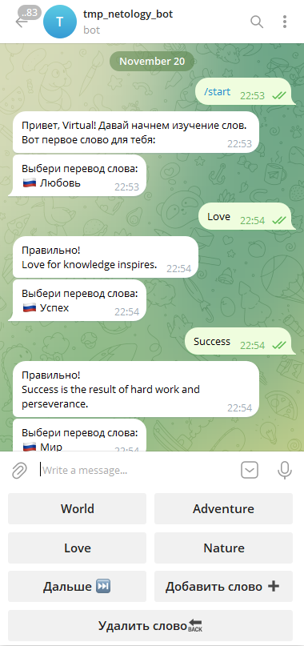

# EnglishCard (TGbot)

Телеграм-бот для изучения английских слов

## Телеграм-бот для изучения английских слов

Этот проект телеграм-бота, разработанный для изучения английских слов. 
Бот предлагает пользователю карточки с английским словом и вариантами перевода. 
Пользователь может выбирать перевод, а бот дает обратную связь о правильности выбора и следующее слово для изучения.

## Функциональность

- Отображение карточек с английским словом и вариантами перевода.
- Возможность добавлять/удалять слова из персонального словаря пользователя.
- Обратная связь о правильности перевода.
- Возможность начать изучение заново.

## Использование

1. Запустите бот, используя команду `/start` или `/cards`.
2. Бот предоставит вам карточку с английским словом и вариантами перевода.
3. Выберите правильный перевод.
4. Получите обратную связь и следующее слово для изучения.
5. Используйте кнопки команд добавления, удаления, пропуска слова.

## Зависимости
pip install -r requirements.txt

- certifi==2023.7.22
- charset-normalizer==3.3.2
- idna==3.4
- psycopg2==2.9.9
- pyTelegramBotAPI==4.14.0
- requests==2.31.0
- urllib3==2.0.7
